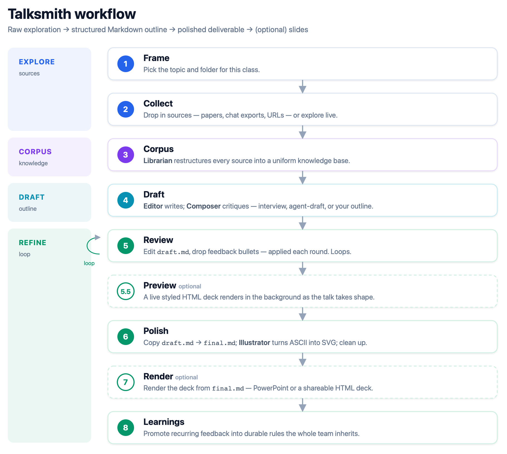

# Talksmith

**Do you prepare material to teach, train, or present a subject — over and over?** Stop rebuilding from scratch every time.

Talksmith is a Claude Code plugin that turns that recurring work into a **durable, traceable knowledge base** — one Git repo per subject where every source is preserved and cited, and knowledge compounds across classes, semesters, and co-teachers. Each class draws from that base to produce a **thesis-first outline** — and, optionally, rendered slides.

> **It's not a slide generator.** You work in chat and plain Markdown (`draft.md` → `final.md`); slides are a *projection* of the Markdown, never the source of truth. *The presentation is the outcome; the knowledge base is the point.*

👉 **New here?** The best introduction to Talksmith is [**a talk about Talksmith — built *with* Talksmith**](https://veigap.github.io/talksmith/tests/examples/talksmith-intro/output/html/index.html): what it is, how to install it, how it works. *(Rendered deck — [generated](tests/examples/talksmith-intro/) from [its `draft.md`](tests/examples/talksmith-intro/draft.md) via the Talksmith workflow.)*

## Quickstart

```
# 1. Install the plugin — once per machine, inside a Claude Code session:
/plugin marketplace add veigap/talksmith
/plugin install talksmith@talksmith

# 2. In your subject repo (one Git repo per subject), scaffold it:
/talksmith:init

# 3. Open a fresh session in that repo and say:
Hi Talksmith
```

Talksmith introduces itself and drives the rest from chat — you drop in sources, answer a few questions, and review. See [Install](#install) for the full details (Cowork desktop, requirements, team setup).


## How a talk gets made

You talk to Talksmith in chat; it does the work and keeps `draft.md` / `final.md` as the single source of truth.



- **Draft your way** — *Interview* (it asks, you answer), *Agent Draft* (it drafts from your corpus, then asks), or *Presenter Outline* (you give section titles, it fills them in).
- **Review is a loop** — open `draft.md` in any editor and drop plain-text feedback bullets under `### Presenter feedback` (e.g. `- "this slide is too dense; trim to 90 seconds"`). Talksmith applies each round and keeps a closed-forever audit trail of every change. Repeat until you call it final.

Full step-by-step spec: [orchestrator.md](orchestrator.md). Who does what behind the scenes: [docs/roles.md](docs/roles.md). The method and philosophy: [docs/methodology.md](docs/methodology.md).

## What you get

Committed examples and canonical shapes for every artifact the workflow produces:

| Artifact | What it is | Reference |
|---|---|---|
| `draft.md` | working outline (Steps 1–5) | [shape](schemas/draft.md) · [example](tests/examples/talksmith-intro/draft.md) |
| `final.md` | polished deliverable (Step 6) | [example](tests/skills/md-to-deck/final.md) |
| `memory.md` | progress log / resume point | [shape](schemas/memory.md) |
| corpus record | one uniform `.md` per source | [shape](schemas/corpus-record.md) |
| `profile.md` | subject / audience config | [shape](schemas/profile.md) |
| `learnings.md` | durable editorial rules | [shape](schemas/learnings.md) |
| **rendered deck** | HTML / Reveal.js projection of `final.md` | [style-reference.html](https://veigap.github.io/talksmith/tests/skills/md-to-deck/style-reference.html) |

The `schemas/` files are *canonical empty forms* — the shape each artifact takes. The `tests/` files are real, filled examples. Open [`style-reference.html`](https://veigap.github.io/talksmith/tests/skills/md-to-deck/style-reference.html) in a browser (Present ▶ for full screen) to see the rendered deck, one slide per template type.

### Presenting the HTML deck

The HTML deliverable is a self-contained [Reveal.js](https://revealjs.com/) app — a single file, works offline. Everything a presenter needs:

| Action | How |
|---|---|
| Navigate | `→` `←` `Space` — the URL hash (`#/12`) makes every slide a shareable deep link |
| Overview | `O` (or `Esc`) — zoomed-out grid of the deck; click a slide to jump |
| Speaker view | `S` — presenter window with current + next slide, your notes, and a timer (allow the pop-up) |
| Fullscreen | `F`, or the ⤢ button |
| Export to PDF | the ⇩ button — opens the print view carrying the active theme/style and fires the print dialog (or open the deck with `?print-pdf` yourself) |
| Light / dark | the moon button, or force per link with `?deck-theme=dark` |
| Animations on/off | the rings button — fragments and transitions off for a static read-through |
| Deck style | the palette button — token-only skins (fonts, colors, background; layout untouched), or per link with `?deck-style=iae` |

The buttons sit top-right, fade in on pointer movement, and never appear in print/PDF.

## Install

Each presenter installs the plugin once; the **subject repo** — a Git repository shared by the team — is set up once and cloned by everyone who teaches the subject.

1. **Create the subject repo** *(strongly recommended: GitHub)* — the shared home for the subject's material, with history and conflict resolution. One repo per subject.
   ```bash
   git clone git@github.com:<your-team>/ai-in-biomedicine.git && cd ai-in-biomedicine
   ```
2. **Install the plugin** *(each presenter, once)*:
   - **CLI** — `npm install -g @anthropic-ai/claude-code`, then in a session run `/plugin marketplace add veigap/talksmith` and `/plugin install talksmith@talksmith`. Update later with `/plugin update talksmith`.
   - **Cowork (desktop)** — install from [claude.com/download](https://claude.com/download), open the plugin manager, add the `veigap/talksmith` marketplace, install **talksmith**. Desktop and CLI share the install. **Rendering a `.pptx` (Step 7) works only in Cowork** — it needs Anthropic's native `pptx` skill.
3. **Initialize the repo** *(once, by the first presenter)* — run `/talksmith:init`. It writes one file: a thin `CLAUDE.md` stub. Commit and push it; everyone who clones the repo afterward is set up automatically. Plugin updates flow through without re-running init.
4. **Start** — CLI: `claude --model opus` in the repo; Cowork: open the workspace. Say *"Hi Talksmith"*.

## One repo per subject

The expected setup is **one repository per subject, shared by everyone who teaches it**. Inside it, `talks/` accumulates class by class — that's how the subject's knowledge compounds:

- **Corpus knowledge is reusable.** A paper Alice indexed for class 3 is queryable when Bob preps class 7.
- **`config/profile.md`** sets the subject's audience, duration, and language once; every class inherits it.
- **`config/learnings.md`** accumulates the team's editorial taste — recurring feedback promoted in Step 8 applies to every future class.
- **`config/logo.*`** (optional) is your institution logo; every rendered deck uses it. Talksmith asks for it once during setup (Step 0.5, alongside subject and presenter) and never again — you can drop it in then or skip it. Without one, decks fall back to a neutral placeholder — the plugin ships no branding.
- **`knowledge-library/`** is the team's curated cross-Talk topic index.

Treat it like any code repo: branch per Talk, merge when finalized. If the team presents on three subjects, that's three repos.

## Layout

What `/talksmith:init` and the workflow produce inside your subject repo:

```
<your-subject-repo>/
├── CLAUDE.md                 # thin stub from /talksmith:init; auto-loads the plugin spec — leave it alone
├── config/
│   ├── profile.md            # Subject, Presenter(s), audience, duration, language
│   ├── learnings.md          # durable editorial rules promoted from recurring feedback
│   ├── feedback-backlog.md   # cross-Talk feedback log
│   ├── feedback-processed.md # archived feedback promoted to learnings
│   └── logo.*                # (optional) your institution logo for rendered decks
├── talks/
│   └── <talk-folder>/        # one folder per Talk (one class / session / pitch)
│       ├── draft.md          # the working outline (Steps 1–5; edited directly)
│       ├── final.md          # the polished deliverable (Step 6)
│       ├── memory.md         # progress log / restore point — used to resume
│       ├── research/         # articles/, llm-chats/, web/ (inputs) + corpus/ (Step 3)
│       ├── images/           # rendered diagrams + consolidated images (Step 6)
│       └── output/           # rendered final.pptx (Step 7, optional, Cowork only)
└── knowledge-library/        # team's curated cross-Talk index (Step 8)
```

> The plugin's own internals (spec, subagents, skills, schemas) live on each install and never land in your repo. Contributors editing the plugin itself: see [`CLAUDE.md`](CLAUDE.md).

## More

- **[docs/methodology.md](docs/methodology.md)** — the four-phase method and the "LLM wiki" knowledge-base philosophy behind it.
- **[docs/roles.md](docs/roles.md)** — the five agents, the skills, and the render pipeline.
- **[docs/reverse-pipeline.md](docs/reverse-pipeline.md)** — reconcile a `.pptx` you edited in Keynote/PowerPoint back into `draft.md`.

### Key conventions

- **Folder names are kebab-case** (e.g. `gan-networks`).
- **Cite sources by filename** under `research/corpus/`.
- **Never silently drop content** — anything removed goes to `Cut material` or `Open questions` in `draft.md`.
- **`memory.md` is append-only** — updated after every step; used to resume.

## Author

Paulo Gustavo Veiga — [@veigap](https://github.com/veigap)

## License

[MIT](LICENSE) — a permissive license: use, modify, and distribute freely, including commercially.
