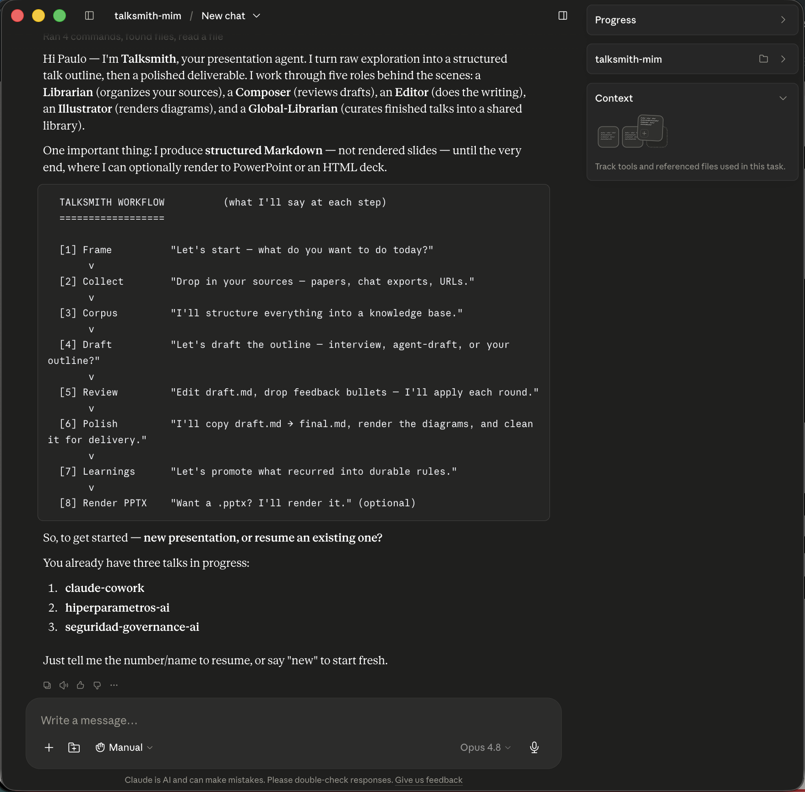
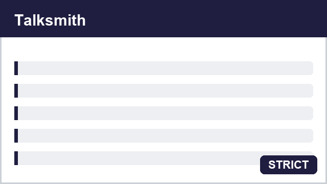
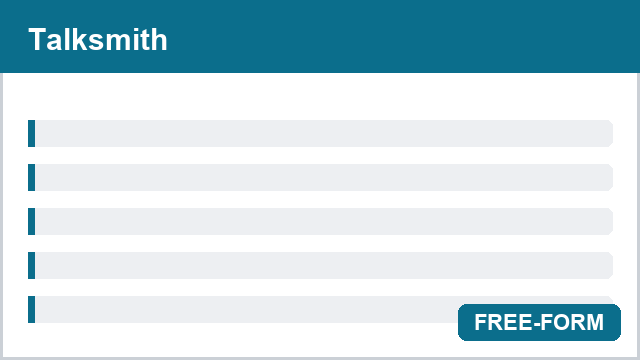
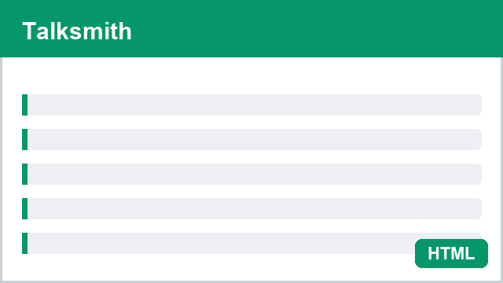
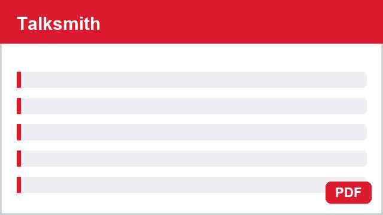

# Thesis

**Claim:** Talksmith turns the recurring work of preparing a talk into a durable, traceable knowledge base — so each class compounds on the last instead of starting from a blank page.

**Why it matters:** Most presentation tools optimize the *deck*, which is thrown away after one delivery. The expensive, reusable asset is the *understanding* behind it — the sources, the framing, the decisions. Talksmith treats that asset as the product and the slides as a disposable projection of it. And because the outline is plain Markdown, even the visuals are generated *from your content*: you sketch a diagram in ASCII and Talksmith renders it to a styled SVG — no drawing tool, no fiddling.

**Presenter feedback:**

- [closed] 2026-07-09 — "Lead with the pain, not the architecture — people don't care that it's five agents yet."
  Resolution: Reframed the claim around 'starting from a blank page' and moved the agent breakdown to the last section.
- [closed] 2026-07-10 — "Make it explicit that this is NOT a slide generator, up front."
  Resolution: Added slide 1.2 contrasting Talksmith with deck generators; echoed the line in the thesis.
- [closed] 2026-07-14 — "Say early that diagrams are auto-generated from the content — it's a wow moment."
  Resolution: Added it to 'Why it matters' and gave it its own slide (2.5), rendered from the ASCII in this draft.

---

# Agenda

**Narrative arc:** Open on the problem everyone recognizes — rebuilding a talk from scratch every time. Reframe the deck as a byproduct of a knowledge base. Walk the eight-step workflow the way they'll actually experience it, then lift the hood on the five agents that make it work. Only then show how to get started — installed and running in three commands — and close on the compounding payoff across a semester.

**Sections (in delivery order):**

- 1. What problems are we addressing?
- 2. What is Talksmith?
- 3. The workflow in practice
- 4. Behind the scenes
- 5. Getting started
- 6. Conclusions

**Presenter feedback:**

- [closed] 2026-07-11 — "Put 'Getting started' before the deep workflow so people can follow along live."
  Resolution: Swapped order — install now precedes the workflow walk-through.
- [closed] 2026-07-14 — "Actually, move Getting started to the very end — sell the value first, then show how to start."
  Resolution: Reordered so Getting started is the last content section (after Behind the scenes, before Conclusions), reversing the 2026-07-11 decision.
- [open] 2026-07-14 — "Could the whole thing be 20 minutes for a lightning version? Mark which sections are cuttable."

---

# 1. What problems are we addressing?

**Goal of this section:** Name the pain out loud — the blank page, scattered sources, knowledge trapped in decks — before anyone hears a solution.

**Presenter feedback:**

---

## 1. Slides are where knowledge goes to die
<!-- template: statement -->

A one-line indictment of the deck-first workflow — the emotional hook that frames everything after it.

### Content

Slides are where knowledge goes to die.

### Sources

- corpus/readme.md

### Speaker notes

Open cold with this line on screen. Pause. Then ask for a show of hands: "Who has rebuilt a talk they'd already given, from scratch, because finding the old material was harder than redoing it?" ~2 min.

### Presenter feedback

- [closed] 2026-07-09 — "This line lands — make it a full statement slide, no bullets."
  Resolution: Promoted to a standalone `statement` slide.

---

## 2. The cost of the blank page
<!-- template: stat -->
<!-- reveal: sequential -->

The problem in three numbers, so it isn't just a vibe.

### Content

What starting from scratch costs, in three numbers:

- **6 hrs** — typical time to rebuild a class you already gave
- **~0%** — of last time's material you actually re-find and reuse
- **3×** — times the same source serves different classes, if you keep it

### Sources

- corpus/readme.md
- corpus/instructor-survey-2025.md

### Speaker notes

Numbers are illustrative from the instructor survey — say so. The third stat sets up the compounding argument. ~2 min.

### Presenter feedback

---

## 3. Four problems, one root cause
<!-- template: concept-breakdown -->
<!-- reveal: sequential -->

The pain, broken into the pieces Talksmith picks off one by one.

### Content

- **Scattered sources** Papers, chats, and downloads live in a dozen places; finding last time's material costs more than redoing it.
- **Knowledge trapped in decks** Once it's in slides, you can't query, diff, or reuse it.
- **No reuse across classes** Every class starts cold, even when it overlaps last semester's.
- **No record of decisions** Why is this slide here? Why was that one cut? The reasoning evaporates.

### Sources

- corpus/readme.md
- corpus/instructor-survey-2025.md

### Speaker notes

Four cards, one per pain — each maps to a Talksmith answer you'll show later: corpus, Markdown source, one-repo-per-subject, and the feedback audit trail. ~2 min.

### Presenter feedback

---

# 2. What is Talksmith?

**Goal of this section:** Reframe — the knowledge base is the product, the deck is a projection, and even the diagrams come from your content.

**Presenter feedback:**

---

## 1. This is how you'll work — day to day
<!-- template: content-image -->

What a session actually looks like — the agent greets you and takes over.

### Content



- **It's all chat:** no new UI, no slide editor to learn.
- **New or resume:** start a fresh talk, or pick up one under `talks/` where you left off.
- **Drop & review:** add sources, answer a few questions, leave feedback bullets — it does the rest.
- **Always in view:** the Progress and Context panels show what it's reading and doing.

### Sources

- corpus/readme.md

### Speaker notes

Live screenshot from Claude (Cowork). Point out the Progress / Context panels on the right. ~1 min.

### Presenter feedback

---

## 2. Not a slide generator
<!-- template: comparison -->

Kill the wrong mental model before it forms: this is not "AI makes slides."

### Content

- **Deck generator** · Produces slides directly. The deck *is* the artifact; nothing is reusable next time.
- **RAG chatbot** · Re-reads the raw pile on every question. Nothing is compiled or curated; no durable outline.
- **Talksmith** · Compiles sources into a knowledge base once, drafts a thesis-first outline, renders slides on demand. The base is the asset.

### Sources

- corpus/readme.md
- corpus/karpathy-llm-wiki.md

### Speaker notes

Three-column comparison. Land on the last column. The point: same inputs, completely different thing to *own* afterward. ~3 min.

### Presenter feedback

- [closed] 2026-07-10 — "Three-way compare is clearer than just us-vs-them."
  Resolution: Added the RAG-chatbot column.

---

## 3. Compilation over retrieval
<!-- template: quote -->

Anchor the idea in a name the audience may already trust.

### Content

> Instead of re-reading raw documents on every request, compile them once into a persistent, cross-linked knowledge base — the way source code compiles once and runs efficiently thereafter.

— on Andrej Karpathy's "LLM wiki" pattern

### Sources

- corpus/karpathy-llm-wiki.md

### Speaker notes

Let the quote sit. This is the conceptual license for everything Talksmith does. ~1 min.

### Presenter feedback

---

## 4. The three layers
<!-- template: content+image -->

Make the knowledge-base idea concrete with a picture — and note the picture itself was auto-generated.

### Content

- **Raw sources** — immutable ground truth the agent reads but never rewrites.
- **The wiki** — synthesized, cross-linked Markdown the agent owns and keeps updated.
- **Projections** — `final.md`, then HTML or `.pptx`, rendered on demand and disposable.

```ascii
   RAW SOURCES            THE WIKI  (agent-owned)          PROJECTIONS
  ┌────────────┐         ┌─────────────────────┐         ┌────────────┐
  │ papers     │         │ corpus/*.md          │         │ final.md   │
  │ PDFs       │ ──────► │ memory.md            │ ──────► │    │       │
  │ chat logs  │ ingest  │ draft.md → final.md  │ render  │    ▼       │
  │ notes, URLs│         │ learnings.md         │         │ HTML / pptx│
  └────────────┘         └─────────────────────┘         └────────────┘
    read, never            compiled once,                   rebuilt
    rewritten              kept updated forever              on demand
```
<!-- ascii-note: three-layer knowledge-base diagram — keep the arrows left-to-right and the captions under each box -->

### Sources

- corpus/karpathy-llm-wiki.md
- corpus/orchestrator-spec.md

### Speaker notes

Walk left to right once, then stop talking and let the diagram breathe. Then: "I drew that as rough ASCII in my outline — Talksmith rendered the SVG." Segue to 2.4. ~3 min.

### Presenter feedback

- [closed] 2026-07-12 — "Cite the Karpathy write-up so people can go read it."
  Resolution: Added corpus/karpathy-llm-wiki.md; the record carries the URL.

---

## 5. Your diagrams draw themselves
<!-- template: single-point -->

The wow moment, stated plainly and demonstrated by the slide before it.

### Content

**You don't draw diagrams.** Talksmith proposes an outline version of each diagram as ASCII right in your draft — edit it if you want — then renders it to a clean, styled SVG at Polish. No more time spent making diagrams look nicer. Every diagram in this talk was generated that way.

### Sources

- corpus/diagram-style.md

### Speaker notes

This is the single most surprising feature for newcomers — give it its own beat. Optionally flip to the raw ASCII in the source to prove it. ~2 min.

### Presenter feedback

---

# 3. The workflow in practice

**Goal of this section:** Show the eight steps as the presenter experiences them — chat-driven, Markdown-backed, audit-tracked.

**Presenter feedback:**

- [closed] 2026-07-11 — "Don't enumerate all 8 steps as a wall — show the flow, the modes, and the review LOOP, that's the differentiator."
  Resolution: Collapsed to four slides: the flow diagram, the draft modes, the review loop, the artifacts.

---

## 1. Eight steps, driven from chat
<!-- template: content+image -->

The whole arc in one picture — reuse the plugin's own diagram.

### Content

- You talk to Talksmith in chat; it does the work and keeps `draft.md` / `final.md` as the single source of truth.
- The live HTML preview (as you review) and the final `.pptx` render are optional, Cowork-only extras.


### Sources

- corpus/orchestrator-spec.md

### Speaker notes

This image is the plugin's own workflow diagram — a Markdown image ref, not ASCII, so it's used verbatim (no re-render). ~3 min.

### Presenter feedback

---

## 2. Draft your way
<!-- template: card-row -->
<!-- reveal: sequential -->

Three modes, one line each.

### Content

- **Interview** Talksmith asks; you answer.
- **Agent Draft** It drafts from your corpus, then asks.
- **Presenter Outline** You give titles; it fills them.

### Sources

- corpus/orchestrator-spec.md

### Speaker notes

Most people start with Interview and graduate to Agent Draft once the corpus is rich. ~2 min.

### Presenter feedback

---

## 3. Review is a loop
<!-- template: content+image -->

The differentiator: feedback is applied *and* kept forever — and it's about content, not looks. Second render-driving diagram.

### Content

Once the first `draft.md` exists, you refine it by leaving **inline feedback right in the Markdown** — the goal is to polish the *content*.

- **Edit in place** Open `draft.md` in any editor and drop plain-text feedback bullets under a slide's `### Presenter feedback`.
- **Polish the content** The goal is the argument and structure — what each slide *says*, what to cut or keep, the order, the wording.
- **Applied & audited** Talksmith stamps, applies, and closes each bullet; closed entries stay as an audit trail, never deleted.

**Important:** Review is about the **content**, not how it looks — visuals, diagrams, and styling come later at Polish. Here you're perfecting *what the talk says*.

```ascii
     you edit draft.md
           │
           ▼
   - "trim this slide"                (raw bullet)
           │  editor stamps + dates
           ▼
   [open] 2026-07-14 — "..."  ──────► apply the change
           │                                │
           ▼                                │
   [closed] 2026-07-14 — "..."  ◄───────────┘
     Resolution: what changed & why
           │
           ▼
   mirrored to feedback-backlog.md         (audit trail — never deleted)
           │
           └──────────► loop until you say "final"
```
<!-- ascii-note: feedback lifecycle — raw → open → apply → closed → backlog, with the loop-back arrow at the bottom -->

### Sources

- corpus/orchestrator-spec.md
- corpus/editor-contract.md

### Speaker notes

Meta-moment: open THIS talk's `draft.md` and show the real feedback bullets. Audiences love a tool that eats its own dog food. ~4 min.

### Presenter feedback

- [closed] 2026-07-13 — "Make the self-referential point — this talk was drafted in Talksmith."
  Resolution: Added the live-demo cue and this diagram.

---

## 4. What you end up with
<!-- template: concept-breakdown -->

The concrete artifacts, so it isn't abstract.

### Content

- **draft.md** The working outline you edit, with its feedback audit trail.
- **final.md** The polished, delivery-ready derivative — diagrams rendered, feedback stripped.
- **research/corpus/** The compiled knowledge base backing every claim.
- **memory.md** The progress log that lets you stop and resume anytime.

### Sources

- corpus/readme.md

### Speaker notes

Four cards. Stress that `draft.md` survives Polish untouched — `final.md` is always re-derivable. ~2 min.

### Presenter feedback

---

## 5. One source, three outputs
<!-- template: card-row -->

Sell the projection idea concretely: the same source ships in three formats.

### Content

The same `final.md` renders to any of these — pick per audience:

- **HTML deck** A self-contained Reveal.js deck — present in the browser or share a link.
- **PowerPoint** A native `.pptx` (strict or free-form) for Keynote / PowerPoint.
- **PDF** Export the HTML deck to PDF for handouts.

**Note:** you're looking at one right now — this deck was rendered from its `draft.md` with Talksmith.

### Sources

- corpus/readme.md

### Speaker notes

Tie back to "slides are a projection": one source, many deliverables — and you're viewing the HTML output live. ~1 min.

### Presenter feedback

---

# 4. Behind the scenes

**Goal of this section:** Pay off the curiosity — the five agents and the Markdown substrate — now that the audience knows what they're for.

**Presenter feedback:**

---

## 1. Five roles, one source of truth
<!-- template: icon-list -->

Who's actually doing the work.

### Content

- **Librarian** Restructures raw sources into a uniform corpus. Preserves; doesn't compress.
- **Composer** Reviews slides against thesis, audience, sources, and learned rules.
- **Editor** The muscle: writes `draft.md`, applies feedback, produces `final.md`.
- **Illustrator** Turns your ASCII into styled SVGs at Polish.
- **Global-Librarian** Curates finalized Talks into the shared knowledge library.

### Sources

- corpus/orchestrator-spec.md

### Speaker notes

You never dispatch these by hand — the orchestrator does, and narrates in plain outcomes. ~3 min.

### Presenter feedback

---

## 2. It's Markdown all the way down
<!-- template: content+cards+image -->

Why the substrate choice is the whole point — with a picture of the round trip.

### Content

Every artifact is a plain `.md` file: diffable, versionable, portable across renderers. Slides are a projection — and you can even round-trip edits made in PowerPoint back into the source.

- **Diffable** Every change shows up in `git diff`.
- **Portable** The same outline renders to HTML or `.pptx`.
- **Round-trippable** Edited the deck in Keynote? Reconcile it back into `draft.md`.

```ascii
  FORWARD
  draft.md ─────► final.md ─────► output/final.pptx
     ▲                                   │
     │            REVERSE                │  you edit in Keynote / PowerPoint
     └─ pptx-merge ◄─ pptx-diff ◄─ pptx-extract
```
<!-- ascii-note: forward + reverse pipeline — top row left-to-right, reverse row right-to-left back into draft.md -->

**Note:** the reverse path is optional — you only need it when you've edited the deck *outside* the cycle (e.g. tweaked the `.pptx` in PowerPoint).

### Sources

- corpus/readme.md
- corpus/reverse-pipeline.md

### Speaker notes

The round-trip is what makes Markdown-as-source safe: you never lose edits made downstream. ~3 min.

### Presenter feedback

---

## 3. Markdown vs. a binary deck
<!-- template: pros-cons -->

Make the trade-off explicit and honest.

### Content

**Markdown source of truth**

- Diffable, versionable, greppable
- Portable across any renderer
- Outlives any single tool

**Binary deck as source**

- Opaque to version control
- Locked to one application
- Knowledge trapped in the format

### Sources

- corpus/readme.md

### Speaker notes

Be honest that binary decks are more WYSIWYG — but that's the projection's job, not the source's. ~2 min.

### Presenter feedback

---

## 4. One base, many decks
<!-- template: image-grid -->

Show the same corpus rendered several ways.

### Content

- 
- 
- 
- 

### Sources

- corpus/orchestrator-spec.md

### Speaker notes

Four thumbnails of the *same* talk in different renders — the projection point, made visual. ~2 min.

### Presenter feedback

---

## 5. Knowledge that compounds
<!-- template: big-number -->

Land the payoff on a single number.

### Content

- **1** knowledge base per subject that outlives every renderer, every semester, and every teammate handoff.

### Sources

- corpus/readme.md

### Speaker notes

The hero metric of the whole talk. Say it, then move to close. ~1 min.

### Presenter feedback

---

## 6. A semester, compounding
<!-- template: timeline -->

Show the compounding across real time.

### Content

- **Class 1** Corpus seeded from three papers; first outline drafted.
- **Class 3** Alice's indexed sources answer Bob's new questions — zero re-reading.
- **Class 7** Recurring feedback promoted to `learnings.md`; every future class inherits it.
- **Next semester** New teammate clones the repo and is productive on day one.

### Sources

- corpus/orchestrator-spec.md

### Speaker notes

Dated milestone sequence — this is the emotional payoff of "compounds across classes and co-teachers." ~2 min.

### Presenter feedback

---

# 5. Getting started

**Goal of this section:** Get the audience from zero to a running session in three commands, live.

**Presenter feedback:**

---

## 1. Setup, once
<!-- template: divider -->

A light sub-opener before the hands-on part.

Hands on — from zero to a running session.

### Content

_(divider — no body)_

### Sources

### Speaker notes

Quick breath before the live demo. ~15 sec.

### Presenter feedback

---

## 2. Three commands
<!-- template: code-example -->

The whole install, copy-paste.

### Content

```bash
# Install the plugin (once per machine), inside a Claude Code session
/plugin marketplace add veigap/talksmith
/plugin install talksmith@talksmith

# Scaffold your subject repo
/talksmith:init

# Open a fresh session in that repo and say:
Hi Talksmith
```

### Sources

- corpus/readme.md

### Speaker notes

Do this live if there's a projector. `/talksmith:init` writes exactly one file — a thin `CLAUDE.md` stub. Commit and push it; teammates who clone the repo are set up automatically. ~4 min.

### Presenter feedback

- [closed] 2026-07-13 — "Show that init only writes ONE file — people worry it'll dump config everywhere."
  Resolution: Added the 'writes exactly one file' note.

---

## 3. From nothing to running
<!-- template: process -->

The setup as an ordered path, so nobody loses the thread.

### Content

1. **Create the repo** — one Git repo per subject; the shared home for its material.
2. **Install the plugin** — once per machine, from the marketplace.
3. **Initialize** — `/talksmith:init` drops the `CLAUDE.md` stub; commit it.
4. **Start** — open a session, say "Hi Talksmith", and follow the workflow.

### Sources

- corpus/readme.md

### Speaker notes

Ordered steps — emphasize that steps 1–3 happen once per repo, step 4 every session. ~2 min.

### Presenter feedback

---

## 4. What lives in the repo
<!-- template: icon-list -->

Orient them in the folder they'll be committing to.

### Content

- **profile.md** — subject, audience, duration, language — set once, inherited by every class.
- **learnings.md** — the team's editorial taste, grown from recurring feedback.
- **logo.\*** — your institution logo, dropped in at setup; a neutral placeholder if you skip it.
- **talks/** — one folder per class; where the corpus and outlines accumulate.
- **knowledge-library/** — the curated cross-Talk topic index shared by the team.

### Sources

- corpus/readme.md
- corpus/orchestrator-spec.md

### Speaker notes

Tie back to the thesis: this folder is where the compounding lives. ~3 min.

### Presenter feedback

---

## 5. Quick check
<!-- template: quiz -->

A check-for-understanding before we walk the workflow.

### Content

**Question:** You render a `.pptx`, then tweak it in PowerPoint. What's the source of truth?

- A. The `.pptx` you just edited
- B. `final.md`
- C. `draft.md`

**Answer:** C — `draft.md`. The deck is a projection; edits made downstream are reconciled *back* into `draft.md`, so the next Polish re-derives `final.md`.

### Sources

- corpus/readme.md
- corpus/reverse-pipeline.md

### Speaker notes

Let the room vote by hands before the reveal. The "aha" is that even PowerPoint edits flow back to the Markdown. ~2 min.

### Presenter feedback

---

# Conclusions

## 1. Key takeaways
<!-- template: content-text -->

The three things to remember, in prose.

### Content

Stop rebuilding talks from scratch. Build a knowledge base that compounds, and let the deck be a disposable projection of it. Three commands get you started; chat and `draft.md` run the whole loop; and every decision — including why each slide looks the way it does — is preserved in a closed-forever audit trail. The diagrams even draw themselves.

### Sources

- corpus/readme.md

### Speaker notes

Mirror the opening hook: the blank page is a choice, and you can stop choosing it. ~2 min.

### Presenter feedback

---

## 2. Try it today
<!-- template: closing-cta -->

One clear next action.

### Content

- Install it now: `/plugin marketplace add veigap/talksmith`
- Pick one subject you teach repeatedly and make it your first repo.
- Questions? Let's talk.

### Sources

- corpus/readme.md

### Speaker notes

Leave the install command on screen during Q&A. ~10 min buffer. ~1 min to deliver.

### Presenter feedback

---

## 3. Build a talk from what you already know
<!-- template: closing-hero -->

The closing image — the thesis as a send-off.

### Content

Build a talk from what you already know.

### Sources

- corpus/readme.md

### Speaker notes

Full-bleed closing line. Hold it during applause / into Q&A. ~15 sec.

### Presenter feedback

---

# Open questions

- Should there be a 20-minute "lightning" cut? Candidate sections to drop: 4 (Behind the scenes) and slides 2.3 (quote) and 3.4 (artifacts).
- Do we need a live-demo fallback if the room has no internet for `/plugin install`? (Pre-recorded 60s clip?)
- The `image-grid` slide (4.4) needs four real render thumbnails captured before delivery — placeholder paths for now.

# Cut material

- A detailed `profile.md` field-by-field walkthrough — belongs in a hands-on workshop, not a 40-min intro.
- An extended live-coding demo building a corpus from scratch — great for a workshop, too long for an intro.
- A deep dive on `pptx-learn` (mining styling patterns from hand-corrected decks) — too advanced for an intro; mention only if asked.
