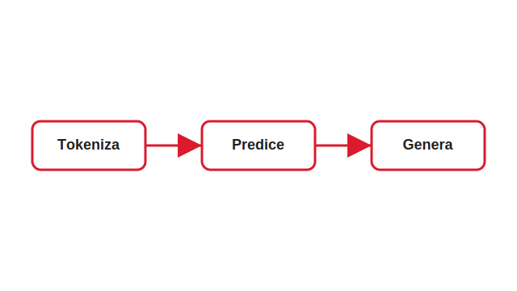

# Agenda

**Sections (in delivery order):**

- Enumeration templates — cards, lists, steps
- Statement, stat & comparison — claims & numbers
- Visual, code & prose — images, code, fallback
- Frame templates — cover, agenda, dividers, closing

---

# 1. Enumeration templates

---

## 〔divisor〕 Sub-opener · plain section title
<!-- template: divider -->

Un divisor sin número — el separador liviano dentro de una sección.

---

## Concept-breakdown · 2 cards
<!-- template: concept-breakdown -->

- **Alucinaciones** Predicen texto plausible; no verifican hechos.
- **No-determinismo** El mismo prompt produce respuestas distintas.

---

## Concept-breakdown · 3 cards
<!-- template: concept-breakdown -->

- **Contexto** Cuánta información dar sin saturar la ventana.
- **Costo** Menos tokens innecesarios, sin perder lo crítico.
- **Claridad** Instrucciones sin ambigüedad para reducir errores.

---

## Concept-breakdown · 4 cards (2×2), long bodies
<!-- template: concept-breakdown -->

- **Seguridad** No todo dato puede salir a un modelo externo; clasificá antes de pegar y evitá secretos, credenciales o información de pacientes en el prompt.
- **Costo** Cada token de entrada y de salida se cobra; cachear las partes reutilizables del prompt reduce el gasto en producción de forma significativa.
- **Latencia** Respuestas más largas tardan más; en flujos interactivos conviene acotar la salida y usar streaming para percibir menor demora.
- **Trazabilidad** Guardá qué se pidió y qué se respondió para poder auditar decisiones sensibles y reproducir problemas cuando algo sale mal.

---

## Concept-breakdown · 6 cards (3×2)
<!-- template: concept-breakdown -->

- **Projects** Todo en un lugar fijo.
- **Skills** Enseñar una vez, reusar.
- **Connectors** Manos hacia sistemas externos.
- **Schedule** Que trabaje solo.
- **Plugins** Empaquetar y distribuir.
- **Governance** Reglas y límites claros.

---

## Card-row · 3 short cards
<!-- template: card-row -->

Tres innovaciones que cambiaron la síntesis de imágenes.

- **Mapping network** Desenreda el espacio latente.
- **AdaIN** Inyecta estilo por capa.
- **Mixing** Combina estilos de dos latentes.

---

## Icon-list · prose rows
<!-- template: icon-list -->

Tres razones para dejar que el modelo piense en voz alta.

- **Debugging** Revela exactamente dónde falló el razonamiento paso a paso, no sólo el resultado final.
- **Calidad** Fuerza al modelo a pensar deliberadamente antes de responder, lo que sube la precisión.
- **Transparencia** Habilita audit trails completos para decisiones sensibles o reguladas.

---

## Process · 3 steps
<!-- template: process -->

- **Paso 1** El texto se parte en tokens que el modelo puede leer.
- **Paso 2** Estima el siguiente token según todo el contexto.
- **Paso 3** Repite token a token hasta completar la respuesta.

---

## Process · 5 steps
<!-- template: process -->

- **Ingesta** Se cargan las fuentes crudas.
- **Corpus** Se estructuran en una base de conocimiento.
- **Draft** Se arma el outline de la charla.
- **Review** Se aplican los comentarios en rondas.
- **Polish** Se genera el entregable final.

---

## Steps · plain numbered list
<!-- template: process -->

1. Identificá qué dato vas a pegar y de dónde viene.
2. Clasificá su sensibilidad: público, interno o confidencial.
3. Elegí una herramienta autorizada acorde a esa clasificación.
4. Registrá qué se compartió, por si hay que auditarlo después.

---

## Steps · con intro
<!-- template: process -->

Antes de pegar cualquier dato en una herramienta de IA, seguí esta rutina de cuatro pasos.

1. Identificá qué dato vas a pegar y de dónde viene.
2. Clasificá su sensibilidad: público, interno o confidencial.
3. Elegí una herramienta autorizada acorde a esa clasificación.
4. Registrá qué se compartió, por si hay que auditarlo después.

---

## Timeline · hitos
<!-- template: timeline -->

- **Marzo 2023** Samsung habilita ChatGPT para sus ingenieros.
- **20 días después** Tres fugas de datos internos, sin un solo hacker.
- **Mayo 2023** Samsung prohíbe las herramientas de IA generativa.
- **2024** La industria adopta políticas de gobernanza de datos.

---

## Single-point · lead + one beat
<!-- template: single-point -->

No todo dato puede ir a un modelo externo. Antes de pegar, mirá qué estás pegando.

- **Regla única** Si no lo pondrías en un email a un tercero, no lo pegues en el prompt.

---

# 2. Statement, stat & comparison

---

## Un mensaje corto y contundente
<!-- template: statement -->

La IA no piensa como un humano — predice el siguiente token.

---

## Título muy largo que debe envolver con elegancia y seguir leyéndose como una sola afirmación fuerte
<!-- template: statement -->

Predice, no razona; no recuerda, no verifica.

---

## Stat · 3 métricas
<!-- template: stat -->

- **~$2,50** por 1M de tokens de entrada.
- **~$10** por 1M de tokens de salida.
- **50–90%** de ahorro con prompt caching.

---

## Stat · 2 métricas grandes
<!-- template: stat -->

- **1M** tokens de contexto en Claude.
- **~750K** tokens ≈ toda la obra de Tolkien.

---

## Comparison · 3 columnas
<!-- template: comparison -->

| Factor | Modelo único | Cascading |
| --- | --- | --- |
| Precisión | Estable, predecible | Depende del routing |
| Costo | Mayor por llamada | Menor en promedio |
| Latencia | Menor (una llamada) | Mayor (fallback) |

---

## Quote · pull-quote
<!-- template: quote -->

"Nadie quería hacer algo malo. Nadie fue negligente. Todos hicimos algo parecido."
— Un ingeniero de Samsung, 2023

---

## Big-number · métrica hero
<!-- template: big-number -->

$2.50
por millón de tokens de entrada — el costo real de mover datos a un modelo externo.

---

## Pros-cons · consumo vs enterprise
<!-- template: pros-cons -->

### Ventajas
Rápido de adoptar, familiar para el equipo, sin costo inicial.
### Riesgos
Datos fuera de control, sin contrato ni borrado, incumplimiento posible.

---

## Comparison · 2 columnas (mito vs realidad)
<!-- template: comparison -->

| Mito | Realidad |
| --- | --- |
| “Todo lo que escribo entrena al modelo” | Depende del plan y la configuración |
| “Grande = seguro y compliant” | El tamaño no implica gobernanza |

---

# 3. Visual, code & prose

---

## Content + image
<!-- template: content-image -->

Un millón de tokens es más contexto del que parece: toda la obra de Tolkien entra con lugar de sobra.



---

## Figures · 3 con diagrama
<!-- template: figures -->

- **Zero-shot** Sin ejemplos, sólo la instrucción.
- **Few-shot** Dos a cinco ejemplos en el prompt.
- **Chain-of-thought** Pide razonar paso a paso.

  

---

## Image-grid · 6 muestras
<!-- template: image-grid -->

     

---

## Content + cards + image
<!-- template: content+cards+image -->

- **Projects** Todo en un lugar fijo.
- **Skills** Enseñar una vez, reusar.
- **Connectors** Manos hacia sistemas externos.


---

## Code-example · caching
<!-- template: code-example -->

```python
client.messages.create(
    model="claude-opus-4-8",
    system=[{"type": "text",
             "cache_control": {"type": "ephemeral"}}],
    messages=turns,
)
```

Marcá las partes reutilizables una vez; el proveedor las cachea y no las re-cobra.

---

## Callout · pink (analogía)
<!-- template: callout -->

- **Como un taxi** Pagás la bajada de bandera (input) y cada cuadra (output).

---

## Content-text · último recurso
<!-- template: content-text -->

La ingeniería de prompts es el arte de estructurar instrucciones para obtener la salida deseada.

- **Menos ambigüedad** → menos alucinación
- **Ejemplos** → mejor formato
- **Restricciones** → salida acotada

---

## Fallback · lead + points
<!-- template: fallback -->

El perímetro no se rompió: se esquivó. Nadie hackeó nada.

Nadie quería hacer algo malo.
Nadie fue negligente con intención.
Todos hicimos algo parecido alguna vez.

---

# 4. Frame templates

---

## Roadmap de la charla
<!-- template: agenda -->

- **Fundamentos** Los modelos base.
- **Interfaz y projects** Lo básico de Cowork.
- **Skills y metadata** Extender el sistema.
- **Buenas prácticas** Qué hacer el lunes.
- **Cierre** Preguntas y próximos pasos.

---

## Closing-cta · recursos
<!-- template: closing-cta -->

- **Fundamentals** aitutorial.dev/foundations
- **Structured prompts** aitutorial.dev/structured
- **Advanced techniques** aitutorial.dev/advanced
- **Optimization & testing** aitutorial.dev/optimize

---

## Q&A
<!-- template: closing-hero -->

paulo@iae.edu · github.com/veigap
